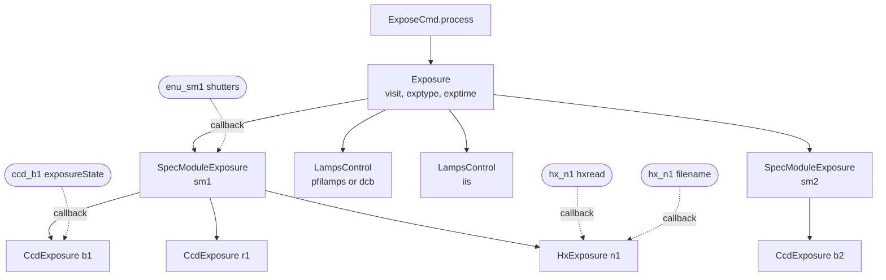
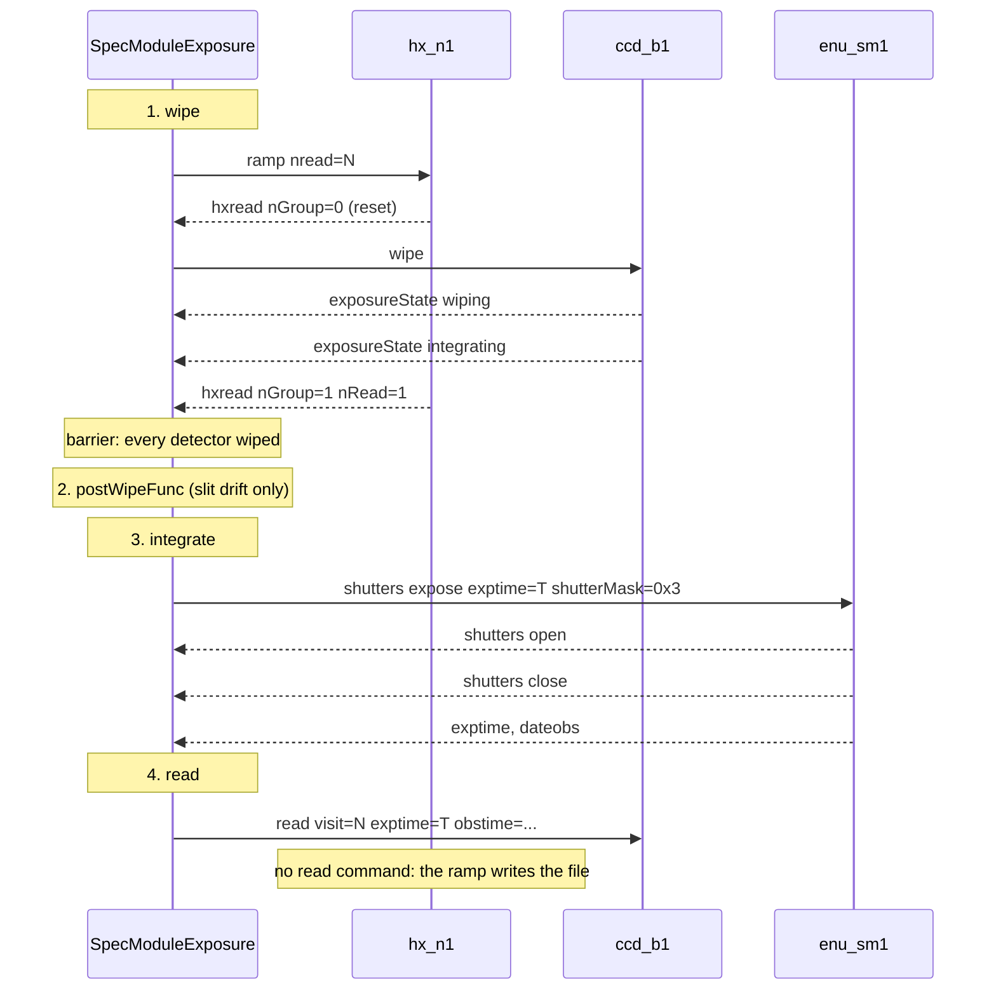
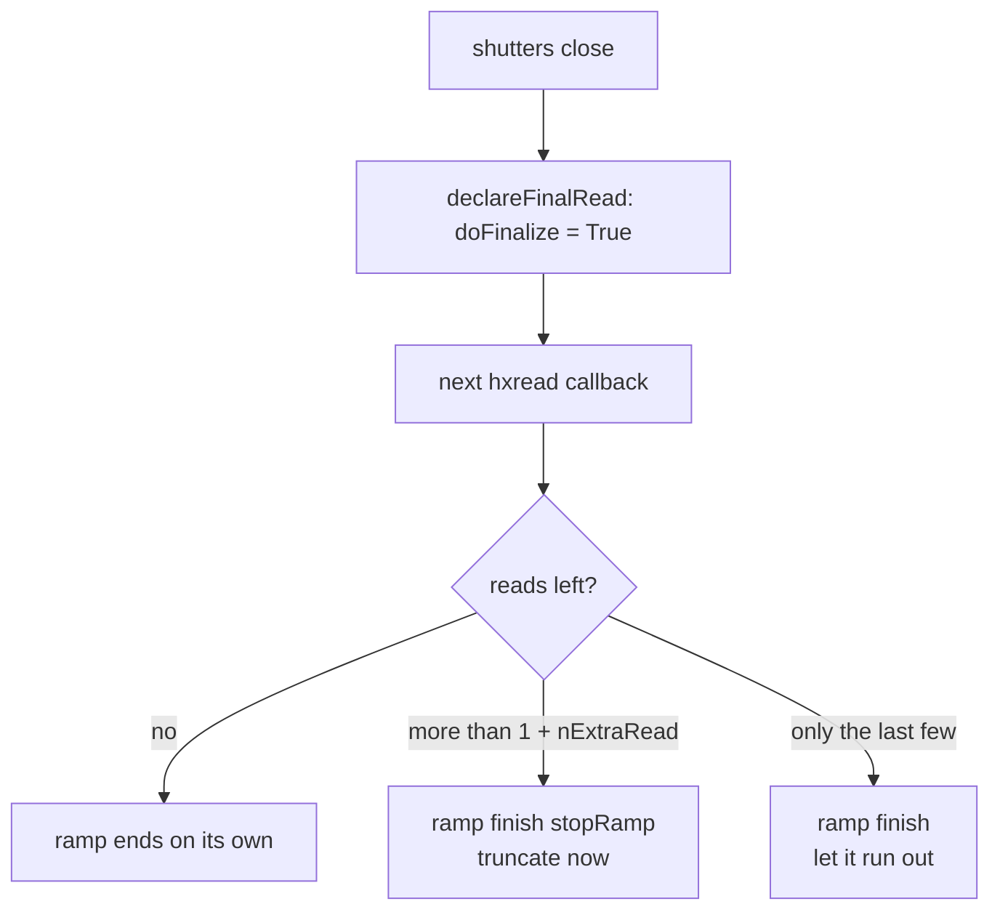
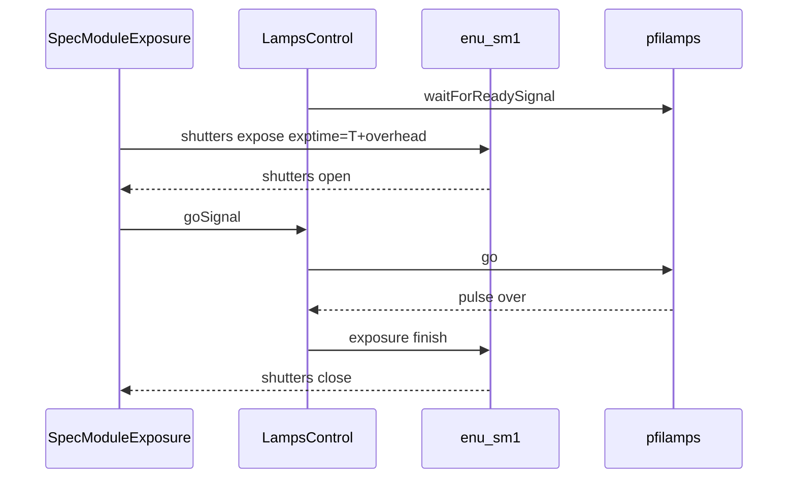
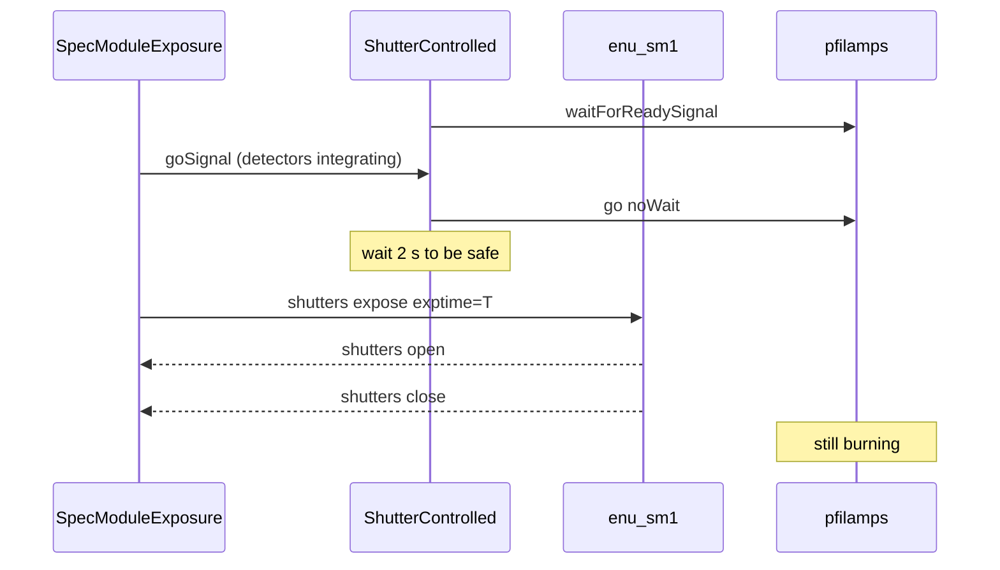
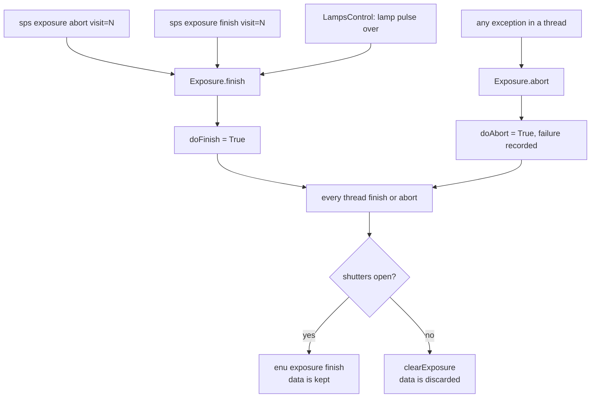
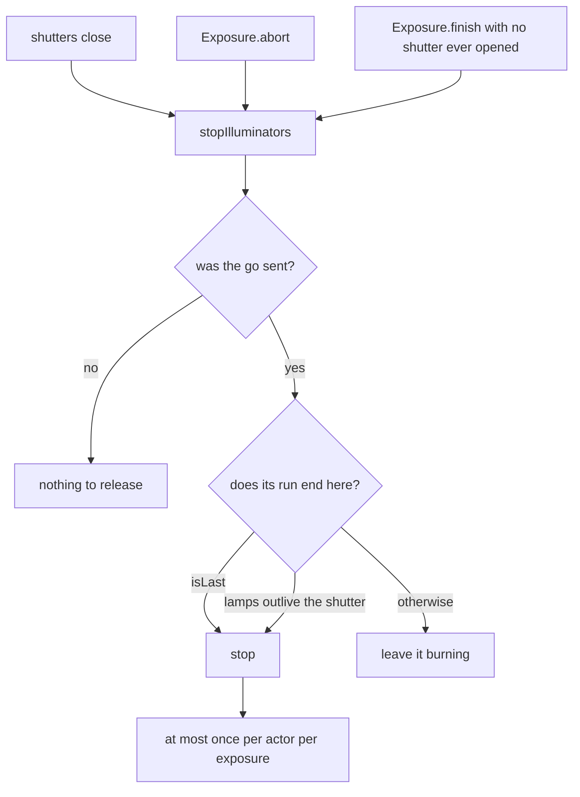

# The SpS exposure workflow

How `sps expose` runs, from the command arriving to the files landing in opdb. The part
worth reading slowly is [two detector families under one shutter](#4-two-detector-families-under-one-shutter):
a CCD is driven step by step, while an H4 free-runs and can only be nudged, and the two
have to bracket the same shutter opening.

Line references are to this repository; they are the authority when this document drifts.

---

## 1. The object graph

One `Exposure` object per visit. It is not a thread: it owns threads and polls them.



Everything below `Exposure` is a `QThread`. The dotted arrows are keyVar callbacks, which
fire on the twisted reactor thread, not on the thread that sent the command — so anything
they trigger must not block. That is why the shutter-close hook hands off to
`@singleShot` methods rather than calling actors inline.

`Exposure.threads` is `smThreads + lampsThreads`; `abort` and `finish` walk that list.

## 2. Which exposure class runs

`ExposeCmd.process` picks the class from the command flags
([ExposeCmd.py:178-190](../python/spsActor/Commands/ExposeCmd.py#L178-L190)):

| command | class | shutter | lamps |
|---|---|---|---|
| `expose bias` / `expose dark` | `exposure.DarkExposure` | never opens | none |
| `expose object` | `exposure.Exposure` | times the exposure | none, or IIS |
| `expose arc doLamps` | `lampsExposure.Exposure` | opens wide, lamps time it | blocking `go` |
| `expose arc doShutterTiming` | `lampsExposure.ShutterExposure` | times the exposure | `go noWait` |
| `... slideSlit=...` | `driftSlitExposure.*` | as above, slit sliding | optional |

`DarkExposure` is the odd one: its `smThreads` are detector threads directly, with no
`SpecModuleExposure` between, so it registers no shutter callback and never reaches the
shutter machinery at all.

## 3. One module exposure, phase by phase

`SpecModuleExposure.expose` ([exposure.py:165-189](../python/spsActor/utils/exposure.py#L165-L189))
is four steps, and each can be interrupted:



The barrier at the end of phase 1 is `syncThreadsToOpen`
([exposure.py:86-89](../python/spsActor/utils/exposure.py#L86-L89)): with
`doSyncSpectrograph` set, *every* module's detectors must be wiped before *any* shutter
opens, so all spectrographs see the same photons. `lampsExposure.Exposure` forces that on
regardless of config.

## 4. Two detector families under one shutter

An H4 has no wipe and no read. It runs a ramp of `nRead` reads and writes its own file;
spsActor cannot stop it mid-read, only ask it to stop after the current one. The code
papers over the difference with three aliases
([hxExposure.py:88-92](../python/spsActor/utils/hxExposure.py#L88-L92)):

```python
# gotcha to pretend this is a ccd.
self.read = self.keepShutterKeys
self.abort = self.finish = self.clearExposure = self.finishRampASAP
```

so `SpecModuleExposure` can treat both the same. What actually differs:

| | CCD `b/r/m` | H4 `n` |
|---|---|---|
| started by | `ccd wipe` | `hx ramp nread=N`, before the wipe |
| `wiped` means | saw `wiping` **and** `integrating` | saw the first read, `nGroup=1 nRead=1` |
| during integration | waits on the wall clock | keeps reading every `readTime` |
| ended by | `ccd read`, sent after the shutter closes | shutter close sets a flag; the *next* read sends `ramp finish` |
| produces its file | in the `read` reply | asynchronously, via the `filename` keyVar |
| discarded by | `ccd clearExposure` | `ramp finish stopRamp` |
| timeout guard | `wipeTimeLim=30`, `readTimeLim=90` | `2*readTime+15` to reset, `3*readTime+15` to first read |

### Why the H4 starts first

The ramp has to be *already running and settled* when the shutter opens, because the
signal is `ramp[-1] - ramp[0]` and `ramp[0]` must be clean. So phase 1 starts the ramp,
waits for the reset frame, and only then wipes the CCDs — a CCD wipe takes seconds, an H4
reset takes two reads, so starting them together would open the shutter before the H4 was
ready.

```
time ──────────────────────────────────────────────────────────────────►

hx_n1     ramp──┬─reset─┬─read1──read2──read3── … ──readK──┬──…──readN─┐
                │       │                                  │           │
                │       │                          declareFinalRead    │
                │       │                                  │      ramp finish
ccd_b1          └─wipe──┴─integrating────────────────────────────read──┘
                        │                                  │
                     barrier                               │
enu_sm1                 └──────────open───exptime───close──┘
```

`nRead` is sized from the exposure time up front
([hxExposure.py:37-53](../python/spsActor/utils/hxExposure.py#L37-L53)):

| exptype | reads |
|---|---|
| `bias` | `0` — the H4 sits the exposure out entirely |
| `dark` | `round(exptime / readTime) + 1` |
| anything else | `(exptime + expTimeOverHead) // readTime + nReadMin + nExtraRead` |

with `nReadMin=3` and `nExtraRead=1` from config: one clean read before the shutter opens,
one after it closes, and one spare so the H4 can be synchronised safely.

### Landing the ramp

When the shutters close, `shuttersCloseCB` calls `declareFinalRead()`, which only sets
`doFinalize` — the reactor thread must not block. The next `hxread` callback decides what
to do with the reads that are left
([hxExposure.py:189-198](../python/spsActor/utils/hxExposure.py#L189-L198)):



The asymmetry is deliberate: truncating a ramp that is nearly done buys nothing and risks
losing the trailing read that brackets the signal.

## 5. Lamps: when the go is sent

Two orderings, and which one you get decides whether the lamps are still burning when the
shutters close.

**`LampsControl` — go after the shutters open.** The shutters are opened wide, the lamp
pulse defines the exposure, and the exposure is cut short as soon as the pulse returns.



**`ShutterControlled` — go before the shutters open.** The lamps are lit for longer than
the exposure and the shutters define it, so the lamps are *still on* at shutter close.



A third case never reaches spsActor's lamp threads at all: for HgCd and HgAr the iic
sequence prepares and fires the lamps once for a whole sequence and sets `doLamps=False`,
so the exposure runs as a plain one and is merely *told* which illuminators are lit. See
[section 8](#8-releasing-the-illuminators).

## 6. The callbacks that synchronise everything

| keyVar | handler | what it triggers |
|---|---|---|
| `enu_smN shutters` | `ShutterState.callback` | `shuttersOpenCB` on open, `shuttersCloseCB` on open-then-close |
| `ccd_XN exposureState` | `CcdExposure.exposureState` | records the states that make up `wiped` |
| `hx_nN hxread` | `HxExposure.hxReadCB` | `reset` / `integrating` / `idle`, and lands the ramp |
| `hx_nN filename` | `HxExposure.newFileNameCB` | marks the H4 storable |

`shuttersOpenCB` fires the IIS go signal once *every* module is open. `shuttersCloseCB`
generates the close keyword once, gated on every module having actually exposed, and tells
the H4 to land ([exposure.py:191-205](../python/spsActor/utils/exposure.py#L191-L205)).

Note the gate: a module whose shutter never opened leaves `didExpose` false, so the close
keyword — and everything hanging off it — never fires.

## 7. Ending early: finish, abort, failure

Three ways in, and they are not the same thing:



`doAbort` and `doFinish` are polled, not signalled: `wipe`, `integrate` and
`waitForGoSignal` check them between sleeps, which is why an interruption takes effect at
the next phase boundary rather than instantly.

The difference that matters: **finish keeps the data, abort discards it** — but only via
`doDiscard`, and only when the shutters never opened. Once they have opened,
`SpecModuleExposure.finish` reads out regardless, because photons already landed.

`sps exposure abort` and `sps exposure finish` both call `Exposure.finish`
([ExposeCmd.py:226-254](../python/spsActor/Commands/ExposeCmd.py#L226-L254)); only the
reply text differs. The abort marks the exposure as ending its illuminator runs first.

## 8. Releasing the illuminators

A lamp controller keeps declaring the configuration it was given until `stop` releases it
— for pfilamps, `lampRequestMask` is built from the pending request and feeds the
`W_AITHGC` header card, so it stays true long after the lamps go dark. The exposure
therefore has to say when a lamp run is over.



Two sources feed it: the threads the exposure drives itself, and the actors named in
`bckIlluminators`, which the iic sequence lit before the exposure existed. The first are
per-exposure by construction; the second span a whole sequence, which is why only the
exposure marked `isLast` releases them.

## 9. Where the code is

| file | what lives there |
|---|---|
| [Commands/ExposeCmd.py](../python/spsActor/Commands/ExposeCmd.py) | vocabulary, argument parsing, class selection, abort and finish |
| [utils/exposure.py](../python/spsActor/utils/exposure.py) | `Exposure`, `SpecModuleExposure`, `DarkExposure`, the illuminator rule |
| [utils/ccdExposure.py](../python/spsActor/utils/ccdExposure.py) | wipe, integrate, read, clear for `b/r/m` |
| [utils/hxExposure.py](../python/spsActor/utils/hxExposure.py) | ramp sizing, read callbacks, landing the ramp for `n` |
| [utils/lampsExposure.py](../python/spsActor/utils/lampsExposure.py) | the lamp-timed and shutter-timed variants |
| [utils/lampsControl.py](../python/spsActor/utils/lampsControl.py) | the two go orderings |
| [utils/shutters.py](../python/spsActor/utils/shutters.py) | shutter state tracking and its callbacks |
| [utils/driftSlitExposure/](../python/spsActor/utils/driftSlitExposure/) | the sliding-slit variants, via `postWipeFunc` |

## 10. Checking a change

[`test/`](../test/README.md) drives all of this against simulated devices, with no hub
behind it. It covers the CCD path only; the NIR arm needs a device that models ramp timing
and file generation, which is the obvious next piece of work.
